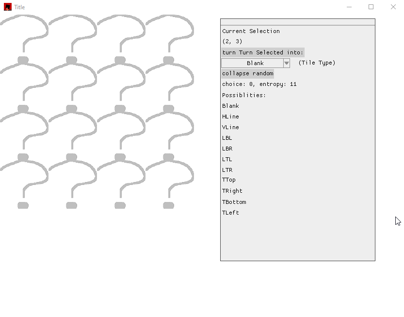
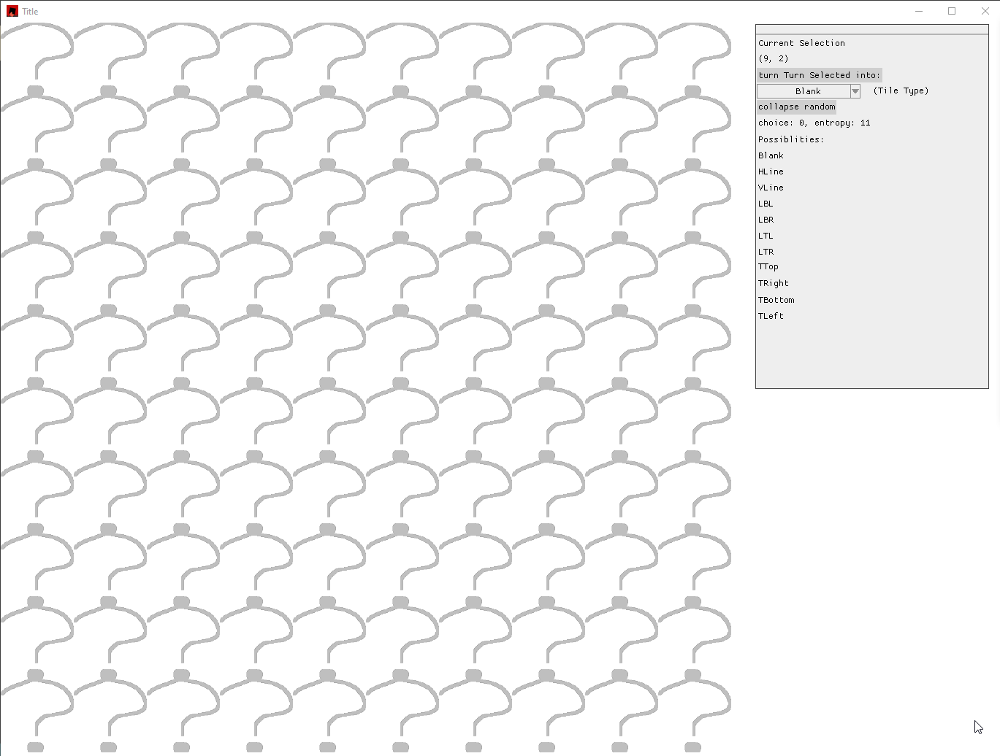

# Pipe Grid

Usage instruction provided in this README
  

[CLICK HERE TO RUN](https://tanekere.github.io/pipe-grid/) This takes a few seconds to load after clicking. Please be patient.

Pipe grid is a demonstration of the wave function collapse algorithm.
This grid generated by this program are guarantied to always connect to ether each other-or the outside. No hanging pipes!

You can assign some of the elements manually using the floating window. The algorithm will adapt to the ones you put in and generate compatible pipes around it.  
To do so, click on which tile wou want to assign. Your choice will be displayed in the floating window. Then pick one of the options from the drop-down menu. Make sure to choose an option displayed in the "possibilities" list, these are the only valid options and the program will not let you insert an invalid option. Finally click the "turn selected tile into:" button. This will turn the tile you selected into the option you selected. Then you can then click the "collapse random" button to witness the algorithm at work.

More advanced demonstration is available [here](#demonstation)

You can choose from the following tiles.  
Blank:  
  
Horizontal line "Hline":  
  
Vertical line "Vline"  
  
L-Shape connected to the following directions:  
Bottom and left "LBL":  
  
Bottom and right "LBR":  
  
Top and left "LTL":  
  
Top and right "VTR":  
  
This is the "none" block .It shows up when the fate of the block has not been decided yet. It can turn into any one of the the blocks in it's options list:  
  
A set of T - Shaped block, where the leg to the 'T' points towards the following directions:  
Bottom "TBottom":  
  
Left "TLeft":  
  
Right "TRight":  
  
Top "TTop":  
  

## Demonstation
more advanced demonstration:  

